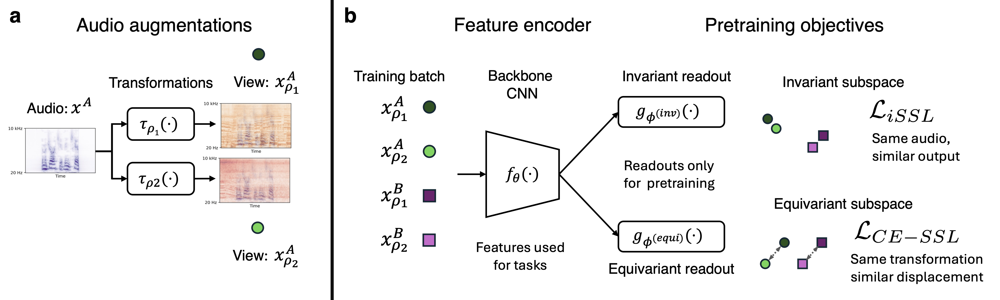

# Human-aligned Universal Audio Representations with Contrastive-Equivariant Self-Supervised Learning

Official repo for the CCN 2026 paper [*Toward Human-aligned Universal Audio Representations with Contrastive-Equivariant Self-Supervised Learning*](https://doi.org/10.32470/uqprhu8).

This repository implements CE-SSL training and evaluation for CochCNN9-style encoders, including linear-probe transfer, zero-shot triplet tasks, parameter decoding, and fMRI analyses reported in the paper.



## Getting Started

Clone with submodules, then create the conda environment:

```bash
git clone --recurse-submodules <repo-url> ce_audio_ssl
cd ce_audio_ssl
mamba env create -f environment.yml -n ce_audio_ssl
mamba activate ce_audio_ssl
pip install -e .
```

**Dependencies**

- `auditory_brain_dnn/` — brain–model comparison ([fork](https://github.com/jenellefeather/auditory_brain_dnn_for_audio_ssl) extended for CE-SSL model lists and activations)
- `byol-a/` — [BYOL-A](https://github.com/nttcslab/byol-a) baseline model training and evaluation (pretrained weights released in this parent repo)
- `robustness/` — Based on [MadryLab/robustness](https://github.com/MadryLab/robustness), with changes for model architectures and audio augmentations.

## Navigating the Code

- [Training configs](model_configs/) control model hyperparameters, audio representation settings, dataset paths, loss settings, optimizer settings, and validation metrics. The main CE-SSL lambda sweep uses files named like [`kell2018_barlow_equivariant_lmbda_1e-2_lr_2e-1_eq_lmbda_5e-01.yaml`](model_configs/kell2018_barlow_equivariant_lmbda_1e-2_lr_2e-1_eq_lmbda_5e-01.yaml); supervised controls are under [`model_configs/supervised_models/`](model_configs/supervised_models/); pretrained AudioMAE and Whisper evaluation configs are also included.

- [`lightning_scripts/train.py`](lightning_scripts/train.py) is the main training entry point. It reads one YAML config, chooses the appropriate Lightning module, and configures trainer-level details such as checkpointing, logging, devices, and resume behavior.

- [`lightning_scripts/lightning_ssl_matched_speech_in_noise.py`](lightning_scripts/lightning_ssl_matched_speech_in_noise.py) contains the CE-SSL training logic. The module selects train and validation datasets from the YAML config, so the same module handles matched speech-in-noise training and AudioSet-only training. It defines how waveform views pass through the audio frontend and encoder + projector, how losses are combined, and how the optimizer and lr scheduler are constructed.

- [`lightning_scripts/architectures.py`](lightning_scripts/architectures.py) defines the encoders and projection heads used by SSL training, including CochCNN9/Kell2018-style and baseline backbones.

- [`lightning_scripts/losses/paired_loss.py`](lightning_scripts/losses/paired_loss.py) defines the core CE-SSL `Paired_Loss`: an invariant SSL loss across matched views plus an equivariant loss on representation differences. The config parameter `lmda` controls the equivariant weight. The included configs use Barlow Twins losses from [`lightning_scripts/losses/barlow.py`](lightning_scripts/losses/barlow.py), with other SSL losses in [`lightning_scripts/losses/`](lightning_scripts/losses/).

- [`robustness/audio_functions/`](robustness/audio_functions/) contains audio transforms and waveform-to-representation code. [`lightning_scripts/jsinV3DataLoader_precombined_batched.py`](lightning_scripts/jsinV3DataLoader_precombined_batched.py) defines `MatchedSpeechInNoiseDatasetBatched` for four matched speech/noise views and `MatchedAudiosetBatched` for matched AudioSet-only views.

## Data And Checkpoints

Datasets and checkpoints are available upon request. Once obtained, set paths with `COCHDNN_*` environment variables (see `default_paths.py`). The key training variables are `COCHDNN_JSIN_TRAIN_H5`, `COCHDNN_JSIN_VALID_H5`, `COCHDNN_AUDIONOISE_TRAIN_H5`, `COCHDNN_AUDIONOISE_VALID_H5`, and `COCHDNN_AUDIOSET_TRAIN_H5`; evaluation scripts also use paths such as `COCHDNN_CHECKPOINT_DIR`, `COCHDNN_ESC50_DIR`, `COCHDNN_NSYNTH_DIR`, `COCHDNN_TONE_PERFECT_DIR`, and `COCHDNN_JSIN_DIR`.

## Evaluation And Notebooks

Transfer, zero-shot, parameter-decoding, and fMRI analysis entry points are in `lightning_scripts/` and `fmri_analysis/`. Start with the demo notebooks in `notebooks/demo_notebooks/`: `audio_transforms_demo.ipynb` shows the matched CE-SSL audio transforms, and `zero_shot_eval_demo.ipynb` runs the NSynth melody-match triplet evaluation path.

Paper figure notebooks are under `notebooks/`, including `figure_2.ipynb`, `figure_3_parameter_decoding.ipynb`, `figure_3_zero_shot.ipynb`, and `figure_4_plot_fmri_components.ipynb`. These notebooks expect generated evaluation outputs such as `eval_jsin_results/`, `eval_nsynth_results/`, and `parameter_decoding_v2/`.
